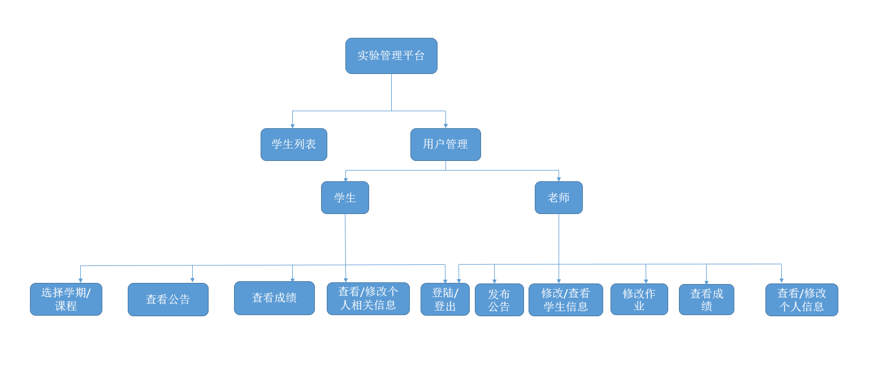
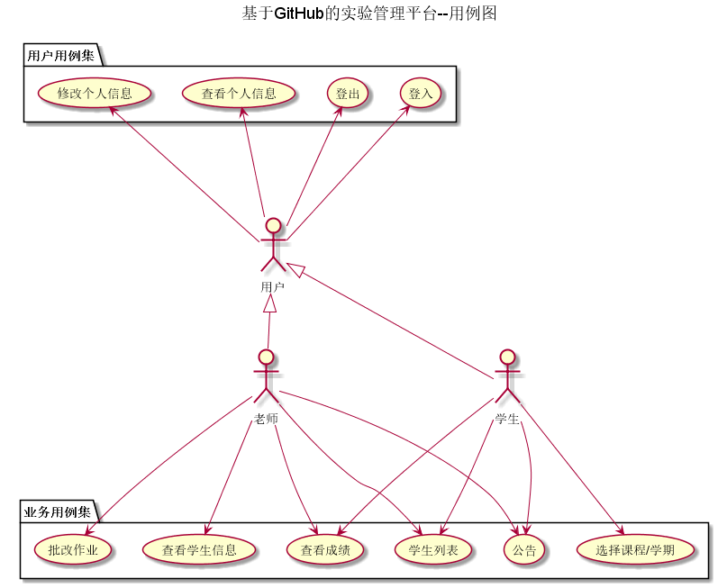

# 实验6：基于GitHub的实验管理平台的分析与设计
|学号|班级|姓名|照片|
|:-------:|:-------------: | :----------:|:----------:|
|201510414221|软件(本)15-2|谢颜浩||

## 1. 概述
- 基于GitHub的实验管理平台的作用是在线管理实验成绩的Web应用系统。学生和老师的实验内容均存放在GitHUB
页面上。
- 学生的功能主要有：一是设置自己的GitHub用户名，二是查询自己的实验成绩。学生的GitHub用户名是公开的，但成绩不公开。
- 老师的功能主要有：一是批改每个学生的成绩，二是查看每个学生的成绩。
- 老师和学生都能通过本系统的链接方便地跳转到学生的每个GitHUB实验目录，以便批改实验或者查看实验情况。
- 实验成绩按数字分数计算，每项实验的满分为100分，最低为0分。
- 系统自动计算每个学生的所有实验的平均分。

## 2. 系统总体结构

# [界面设计参见](https://github.com/mousezz/is_analysis/test6/Ui/index.html)

## 3. 用例图设计 [源码](src/usecase.puml)

## 4. 类图设计 [源码](src/class.puml)
## 5. 数据库设计  [源码](Database.md)
## 6. 用例及界面详细设计

- ### [“修改个人信息用例”用例](./Use_Case/修改个人信息用例.md)
- ### [“公告”用例](./Use_Case/公告用例.md)
- ### [“学生列表”用例](./Use_Case/学生列表用例.md)
- ### [“批改作业”用例](./Use_Case/批改作业用例.md)
- ### [“查看个人信息”用例](./Use_Case/查看个人信息用例.md)
- ### [“查看学生信息”用例](./Use_Case/查看学生信息用例.md)
- ### [“查看成绩”用例](./Use_Case/查看成绩用例.md)
- ### [“登入”用例](./Use_Case/登入用例.md)
- ### [“登出”用例](./Use_Case/登出用例.md)
- ### [“选择”用例](./Use_Case/选择用例.md)
