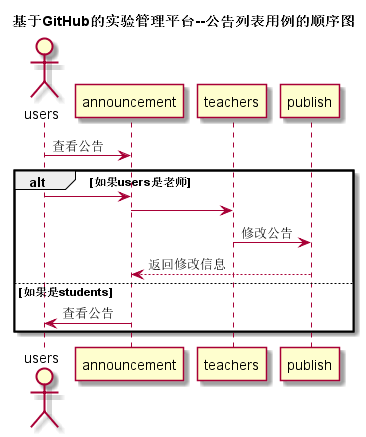

## “公告”用例

### 1. 用例规约

用例名称 | 公告列表
---|---
功能 | 以表形式的显示出所有公告
参与者 | 学生、老师
前置条件 | 1. 老师学生进入公告列表,用户类型  2.根据用户类型系统判断用户权限,是否可以发布或查看公告 3.老师可以修改和发布公告 4.学生只能查看公告. 
后置条件 | 
主事件流 | 
备选事件流 | 

### 2. 业务流程（顺序图）

### 3. 界面设计
# [界面设计参见](https://mousezz.github.io/is_analysis/test6/Ui/index.html)
- API接口调用
    - 接口1：[getAnn](../Interface/getAnn.md)

### 4. 算法描述
无

### 5. 参照表
- [数据库设计](../Database.md)
