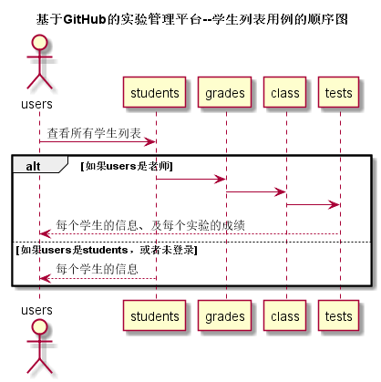

## “学生列表”用例

### 1. 用例规约

用例名称 | 学生列表
---|---
功能 | 以表形式的显示出所有学生的信息
参与者 | 游客，学生，老师
前置条件 | 学生，老师需要先登录
后置条件 | 
主事件流 | 
备选事件流 | 

### 2. 业务流程（顺序图）[源码](../puml_use/getStudent.puml)

### 3. 界面设计
# [界面](https://mousezz.github.io/is_analysis/test6/Ui/index.html)
- API接口调用
    - 接口1：[getStudents](../Interface/getStudent.md)

### 4. 算法描述
无

### 5. 参照表
- [数据库设计](../Database.md)
