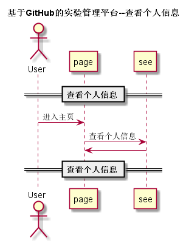

## “查看个人信息”用例

### 1. 用例规约

用例名称 | 查看用户信息
---|---
功能 | 查看用户的所有信息
参与者 | 学生、老师
前置条件 | 必须先登录
后置条件 | 
主事件流 | 
备选事件流 | 

### 2. 业务流程（顺序图）

### 3. 界面设计
# [界面](https://mousezz.github.io/is_analysis/test6/Ui/index.html)
- API接口调用
    - 接口1：[getStudentInfo](../Interface/getStudentInfo.md)
    - 接口2：[getTeacherInfo](../Interface/getTeacherInfo.md)

### 4. 算法描述
无
 

### 5. 参照表
- [数据库设计](../Database.md)
