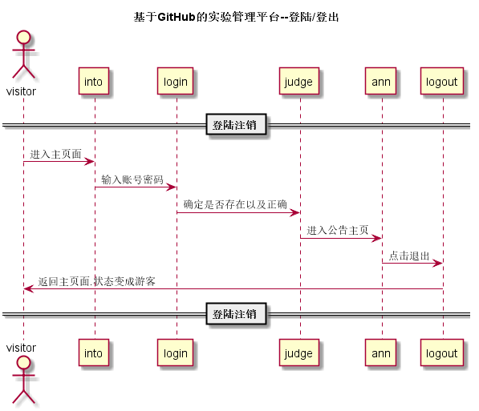

## “登录”用例

### 1. 用例规约

用例名称 | 登录
---|---
功能 | 登录平台
参与者 | 访客
前置条件 | 
后置条件 | 登出后，跳转到登录页面
主事件流 | 1. 访客输入用户名和密码，选择用户类型  2.系统判断用户名，密码，用户类正确，允许登录 3.系统在客户端以Cookie形式存储登录用户信息，保持登录的持久性。
备选事件流 | 1a. 输入的用户名或者密码为空   1.提示重新输入    2.访客重新提交登录信息  2a.系统判断用户名，密码，用户类不正确，不允许登录  1.提示重新输入    2.访客重新提交登录信息

### 2. 业务流程（顺序图）[源码](../puml_use/loginOrout.puml)

### 3. 界面设计
# [界面](https://github.com/mousezz/is_analysis/test6/Ui/index.html)
- API接口调用
    - 接口1：[login](../Interface/login.md)

### 4. 算法描述
无
### 5. 参照表
- [数据库设计](../数据库设计.md)
