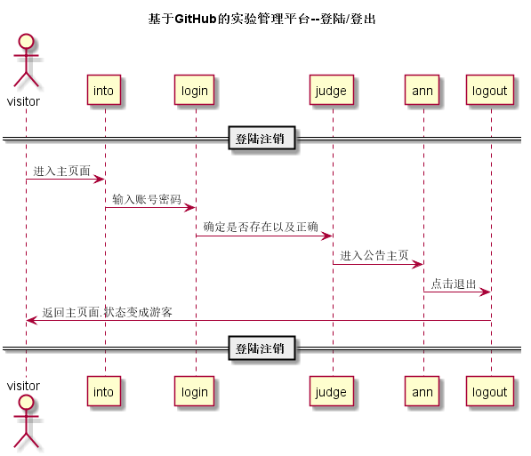

## “登出”用例

### 1. 用例规约

用例名称 | 登出
---|---
功能 | 用户登出平台
参与者 | 学生、老师
前置条件 | 
后置条件 | 登出后，跳转到登录页面
主事件流 | 1. 系统清除客户端登录信息（Cookie）
备选事件流 | 1a. 如果用户登录之后，长时间不超作界面，导致Cookie失效   1.系统清除客户端登录信息（Cookie)

### 2. 业务流程（顺序图）[源码](../puml_use/loginOrout.puml)

### 3. 界面设计
# [界面](https://github.com/mousezz/is_analysis/test6/Ui/index.html)
- API接口调用
    - 接口1：[logout](../Interface/loginOut.md)

### 4. 算法描述
无
 

### 5. 参照表
- [数据库设计](../Database.md)
